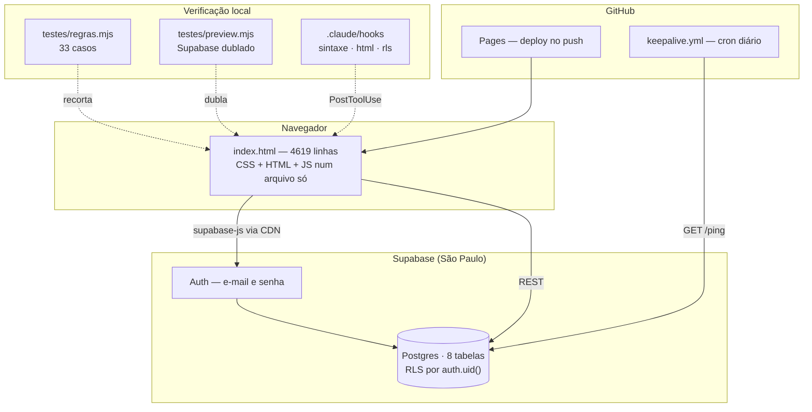
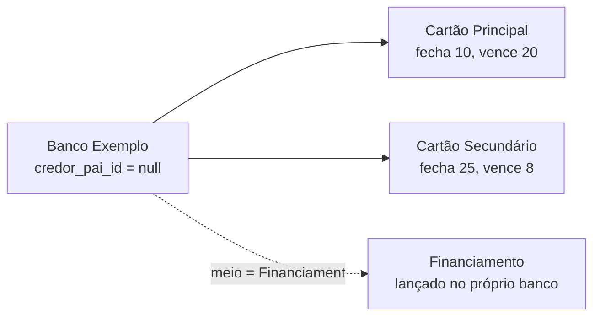

# Mapa do código

Lágrimas do CLT é um organizador financeiro pessoal de um usuário só. Site estático no
GitHub Pages, dados no Supabase. Tudo em português do Brasil: interface, banco,
comentários, commits.

> Este repositório é público e não guarda dado financeiro real. Todo exemplo
> daqui para baixo, e também a carga da seção 3 do SQL, a fixture de
> `testes/regras.mjs` e o cenário de `testes/preview.mjs`, é fictício.

## Visão geral



**Uma única dependência em tempo de execução**: `supabase-js`, por CDN, em ESM.
Sem build, sem bundler, sem `npm install`. Gráficos, calendário e listas
suspensas são escritos à mão.

## Estrutura

| Caminho | Papel | Linhas |
|---|---|---|
| `index.html` | CSS, HTML e o JS de tela | 4380 |
| `js/` | núcleo, domínio e navegação, como ES Modules | 445 |
| `supabase-setup.sql` | Fonte única do schema, em 5 seções, re-executável | 429 |
| `testes/preview.mjs` | Gera `preview.html` com Supabase dublado | 190 |
| `README.md` | Instalação e uso | 190 |
| `testes/regras.mjs` | 33 casos sobre funções recortadas do `index.html` | 150 |
| `.claude/skills/nova-migration/SKILL.md` | Roteiro para mexer no schema | 127 |
| `.claude/hooks/checa-html.mjs` | Tags fechadas, ids únicos | 121 |
| `.claude/hooks/checa-rls.mjs` | RLS, policy, trigger, ordem das FKs | 98 |
| `.claude/hooks/checa-sintaxe.mjs` | O JS compila e todo `$("id")` existe | 64 |
| `.github/workflows/keepalive.yml` | Ping diário no Supabase + commit semanal | 70 |

### Dentro do `index.html`

| Faixa | O que é |
|---|---|
| 18–33 | o único script fora do módulo: resolve o tema antes da primeira pintura |
| 35–784 | `<style>` — tokens em três camadas, componentes, temas |
| 786–1399 | `<body>` — login, shell, 6 seções, 6 diálogos |
| 1400–4378 | `<script type="module">` — imports, render, diálogos, dados, sessão |

O cálculo não está mais aqui. Núcleo e domínio são ES Modules em `js/`, e
`docs/ARCHITECTURE_V2.md` tem o mapa de quem pode importar quem.

O JS tem oito seções nomeadas por comentário de banner (a de DADOS faltava nesta
tabela, embora sempre tenha existido no arquivo):

| Linha | Seção |
|---|---|
| 1404 | CONFIGURAÇÃO — URL e chave publicável do Supabase |
| 1418 | ESTADO E UTILITÁRIOS — `S` e as funções puras de cálculo |
| 1635 | RENDER — mês, dívidas, receitas, filtros |
| 2368 | PAINEL — gráficos SVG, credores, contas fixas, projeção |
| 2963 | DADOS — as sete consultas e a regra de tudo ou nada |
| 3061 | INTERAÇÃO — tema, listas suspensas, calendário, diálogos, formulários |
| 4341 | IMPORTAR LANÇAMENTOS — CSV de entrada e de saída |
| 4570 | SESSÃO — login, logout, guarda de configuração |

`testes/regras.mjs` recorta a faixa de **ESTADO E UTILITÁRIOS** (de
`const S = { dividas:` até o banner `RENDER`) e roda em Node.

## O modelo

### Nada é armazenado mês a mês, com duas exceções

Uma dívida é um **intervalo**, não uma coleção de linhas:

```
mes_inicial + parcela_inicial + total_parcelas  →  em que meses ela aparece
```

`restantesDe(d) = (total_parcelas − parcela_inicial) + 1`. Corrigir um valor
corrige o histórico inteiro de uma vez, porque não há histórico duplicado.

As duas exceções existem porque **não se derivam**:

| Tabela | O que guarda | Por que não dá para calcular |
|---|---|---|
| `pagamentos` | (mês, item) pago | Pagar é um ato, não uma consequência |
| `fixas_mes` | valor real de uma conta variável num mês | A conta de luz de outubro chega, não se calcula |

### Quatro eixos independentes

| Eixo | Pergunta | Coluna |
|---|---|---|
| **credor** | de quem se deve | `credor_id` → `credores` |
| **meio** | como se paga | `dividas.meio` |
| **categoria** | no que foi | `dividas.categoria` |
| **rateio** | de quem é o gasto | `pessoa_id` + `valor_terceiro` |

O rateio separa *o que você deve* de *o que você gastou*. Uma compra de R$ 340
rachada ao meio continua sendo R$ 340 que você paga ao credor — `valor` não muda
— mas R$ 170 voltam. `valor_terceiro` é por parcela, igual a `valor`.

Cobre você mais uma pessoa. Racha de três vira dois lançamentos: foi escolha
consciente, para não trocar duas colunas por uma tabela com RLS e formulário
repetível antes de o caso aparecer.

### Credor é hierárquico, com exatamente dois níveis



`paiDe` / `raizDe` / `filhosDe` resolvem **um** nível só. O invariante é
garantido pela tela: `montaPais()` só oferece credores sem pai e desabilita o
campo quando o credor já tem filhos. O banco reforça com `credores_pai_nao_e_si`.

Só **cartão** vira produto. Financiamento e empréstimo não passam por fatura.

### Em qual fatura uma compra cai

```js
let mesFecha = mês da compra;
if (dia >= fecha) mesFecha += 1;     // >= : compra no dia do fechamento já é do ciclo seguinte
return mesFecha + (vence > fecha ? 0 : 1);
```

A convenção é `>=` e não `>`: a compra feita no próprio dia do fechamento já
pertence ao ciclo seguinte, porque o extrato é cortado naquele dia. Com `>`, ela
cairia um mês antes do que a fatura cobra.

A dedução é **sugestão, não imposição**. `mesManual` vira `true` assim que a
pessoa mexe no campo do mês, e a regra passa a ser um aviso com um botão.

### À vista não é "1 de 1"

`total_parcelas = 1` continua sendo a representação, mas a leitura distingue: sem
barra de progresso, sem contagem de pagas, sem intervalo de meses, sem "/mês" e
sem etiqueta de última parcela. O formulário pergunta antes: *à vista ou
parcelado*.

### Parcelas anteriores ao cadastro

Quem entra na parcela 4 de 9 pagou 3 antes. Elas **aparecem** nos meses delas,
derivadas para trás pelo mesmo intervalo, já marcadas como pagas — e a marca não
é botão, porque não existe linha em `pagamentos` para tirar.

Entram só na lista do mês. Nenhuma soma de saldo passa por ali.

### Conta fixa que varia

`fixas.valor` é a **média**; `fixas_mes` guarda o real de um mês. Informar
outubro não reescreve setembro nem muda o palpite de novembro. Na aba Mês o valor
vira botão: com etiqueta "média" enquanto é palpite, sem ela depois de informado.

## Schema

8 tabelas. 5 seções: TABELAS, SEGURANÇA, CARGA INICIAL, MIGRAÇÃO, CONFERÊNCIA.

| Tabela | RLS | Policy | Trigger |
|---|---|---|---|
| dividas, fixas, fixas_mes, credores, receitas, pagamentos, config | sim | `user_id = auth.uid()` | `set_user_id` |
| ping | sim | `select` para `anon` | — (sem `user_id`, de propósito) |

`set_user_id()` só preenche se vier nulo; a policy `with check` barra quem tentar
mandar `user_id` alheio.

Chaves estrangeiras: `user_id → auth.users` em **cascade**; `credor_id`,
`credor_pai_id` e `pessoa_id` em **set null**; `fixas_mes.fixa_id` em **cascade**.
Apagar um credor nunca apaga histórico.

**`pagamentos.item_id` é texto livre, não FK** — guarda o uuid da dívida ou
`"fx:<id>"`. Quem limpa é o app: os handlers de exclusão apagam as marcas junto.

## Interface

### Peças escritas à mão

| Peça | Por que não é nativa |
|---|---|
| 4 gráficos SVG | sem biblioteca, por princípio do projeto |
| Botão de tema | três estados num botão só; ver abaixo |
| Calendário de dia (`#cal`) | o nativo muda de cara em cada navegador |
| Seletor de mês (`#calM`) | idem; um popover serve os três campos de mês |
| Lista suspensa (`.selpop`) | a lista que o `<select>` abre é do sistema e não aceita CSS |
| Campo com sugestão | `<datalist>` abre a mesma lista do sistema |

Em todas, o elemento nativo continua embaixo guardando o valor. No celular a
lista do sistema é melhor com o polegar, então a troca só acontece onde há mouse
(`matchMedia("(pointer: fine)")`).

### Tema

Três estados, um botão que gira entre eles: **automático → claro → escuro →
automático**. Automático é o padrão e é o comportamento que o app sempre teve;
sem essa terceira posição o primeiro clique tiraria para sempre a capacidade de
seguir o agendamento noturno do aparelho.

```
localStorage "quitacao:tema"  →  script do <head>  →  <html data-tema>  →  CSS
```

Quem pinta é o CSS, e ele lê **só o atributo**, nunca `prefers-color-scheme`.
Quem lê o sistema é o script inline do `<head>`, o único fora do módulo: ele
resolve "automático" contra o sistema **antes da primeira pintura**, senão a
tela escura acende branca a cada abertura, porque o módulo só roda depois do
HTML inteiro. O módulo repete a mesma conta em `aplicaTema`, que é quem troca
daí em diante.

A consequência que importa para quem for mexer: **a camada semântica continua
existindo uma vez só**. Uma media query para o automático mais um bloco igual
para a escolha manual obrigaria a manter as duas em duplicata, e a primeira cor
esquecida num dos lados abriria um tema pela metade.

Os gráficos não são redesenhados na troca: `corCat` devolve `var(--sN)`, então a
cor vem do CSS e o SVG já pintado acompanha sozinho. `localStorage` em janela
anônima levanta exceção; quando isso acontece a escolha vale só na aba aberta, e
o padrão cai no automático em vez de cair no claro.

### Diálogos

`dlgDivida`, `dlgFixa`, `dlgFixaMes`, `dlgDetalhe`, `dlgCredor`, `dlgReceita`.

O cartão da dívida tem **dois alvos**: o corpo abre `dlgDetalhe` (olhar), o lápis
abre `dlgDivida` (editar).

### Gráficos

| Função | Forma | Dado |
|---|---|---|
| `renderQuando` | 4 barras (semanas do mês) | só lançamentos com `data_compra` |
| `renderBurn` | área + linha | saldo residual até a última parcela |
| `renderFluxo` | barras divergentes no zero | sobra mensal, 12 meses fixos |
| `renderProj` (corpo) | barras empilhadas + linha de renda | horizonte e recorte configuráveis |

`corCat()` prende a cor à **entidade**, nunca ao ranking: filtrar não repinta
ninguém. `ligaTip` usa `box.onpointermove =` por propriedade, não
`addEventListener` — cada render substitui o handler em vez de empilhar.

## Convenções

- Todo dado do usuário passa por `esc()` antes de entrar em `innerHTML`.
- Cor só por variável CSS. O tema escuro sai de graça.
- Dinheiro por `money()` — ele já traz o "R$". Porcentagem por `pct()`, mês por
  `label()` / `labelLong()`.
- Excluir é dois cliques no mesmo botão, com reversão em 4s. Nunca `confirm()`.
- Escrita: frase curta, sem jargão, sem exclamação.
- Mensagens de erro usam `textContent`, não `innerHTML`.

## Armadilhas

**Migração ANTES do deploy.** Publicar código que consulta uma coluna ou tabela
nova antes de rodar o SQL derruba o app. Aconteceu duas vezes em 12/09/2026: a
primeira parou o carregamento inteiro, a segunda só o salvamento.

**A carga é tudo-ou-nada, com uma exceção.** A régua: *sem essa tabela, o app
sabe menos ou mente?* Sem `pagamentos`, tudo pareceria não pago — mentiria, então
é fatal. Sem `fixas_mes`, conta variável mostra a média — sabe menos, então
degrada em silêncio, com aviso no console.

**`testes/regras.mjs` recorta por marcadores de texto literais**:
`"const S = { dividas:"` e o banner antes de `RENDER`. Reformatar qualquer um
quebra o teste sem quebrar o app.

**`testes/preview.mjs` procura a linha exata do `import` do supabase-js**, e se
recusa a gerar com seed incoerente: recalcula a fatura de cada compra de cartão.

**A chave publicável está visível e o repositório é público.** RLS é a única
proteção. Toda tabela nova com dado pessoal precisa, no mesmo commit: `enable row
level security`, policy por `auth.uid()`, trigger `set_user_id` e índice.

**Erros de nome não são pegos por teste nenhum.** Três apareceram em 12/09/2026:
"Saldo devedor" que era total a pagar; um filtro comparando com o eixo errado
(`d.categoria !== "Financiamento"`, quando Financiamento é *meio*, então a
condição era sempre verdadeira); e uma contagem de parcelas pagas lida como o
número da parcela atual. A expressão está correta e responde outra pergunta.

**Coluna de grid não encolhe sozinha.** `1fr` não significa "o que couber": o
padrão `min-width:auto` faz a trilha crescer até o filho mais largo, e como o
`.app` é um grid, isso empurrava a página inteira. Era o que acontecia na
Projeção no celular: a tabela de 677px esticava o documento para 707px num
aparelho de 360, e o `.tablewrap` com `overflow-x:auto` nunca chegava a rolar,
porque não havia o que apertar. O mesmo valia para o grid `.kpis`, onde
`money()` devolve um valor na casa das centenas de milhar com espaço
inquebrável, e a figura de 23px vira uma palavra só de uns 214px. `min-width:0` em `.app > div` e uma coluna só
abaixo de 520px resolvem. Ao acrescentar qualquer peça larga, meça a rolagem
lateral em 320, 360 e 390: é a classe de defeito que não aparece no monitor.

**Heredoc come barra invertida.** Escrever código com regex por
`bash <<'EOF'` transformou `\b` em bytes de backspace reais — invisíveis no grep,
aprovados pelo `node --check`, e a regex nunca casava. Use a ferramenta Write.

## O que ficou de fora, de propósito

**O importador de CSV não conhece as colunas de rateio** — `pessoa_id` e
`valor_terceiro`. Importa credor, meio, categoria, valor, parcela, total, mês e
data.

## Pendências técnicas

O estado de qualquer base em uso não mora aqui: este arquivo descreve o código.
O que segue é dívida técnica conhecida, levantada por leitura do próprio
`index.html`.

| O quê | Onde |
|---|---|
| `fixasEstimadas` está escrita e nunca é chamada. O comentário dela promete entrar na frase da sobra, e a frase não diz quanto do número ainda é média | `index.html`, ESTADO E UTILITÁRIOS |
| "Sobra" no Painel e "Sobra estimada" no Mês podem divergir: a primeira vem de `totalDividas`, que ignora as parcelas anteriores ao cadastro; a segunda vem de `itensDoMes`, que as inclui | `renderPainel` e `renderMes` |
| O rateio não chega ao fluxo nem à projeção: `totalDividas` usa a parcela cheia, então nenhuma tela desconta o que volta de terceiro | `totalDividas`, `renderFluxo`, `renderProj` |
| Conta variável aparece com a média sem etiqueta na aba Dívidas, enquanto na aba Mês a etiqueta existe | `renderFixas` |
| `pagamentos` é carregada sem paginação. O PostgREST corta em 1000 linhas por padrão, e aí item pago volta como não pago | `carregaAgora` |
| A projeção recalcula `saldoAposMes` por linha da tabela, e `renderAll` redesenha as sete telas a cada mudança | `saldoRestante`, `renderAll` |

## Onde mexer para cada coisa

| Tarefa | Arquivos e pontos |
|---|---|
| Nova tabela | `supabase-setup.sql` seções 1 e 2 (os quatro blocos juntos); use `/nova-migration`; **rode o SQL antes de publicar** |
| Nova regra de cálculo | `index.html` 1378–1594, e um caso em `testes/regras.mjs` |
| Novo gráfico | `index.html` 2328+, usando `svgEl` e `ligaTip`; cor por `corCat` |
| Novo campo num formulário | markup em 1010–1359, `abre*` e o submit em 3021–4239, coluna no SQL |
| Mudar cor ou espaçamento | só a camada semântica do CSS e o bloco escuro |
| Nova coluna no CSV | `COL_IMPORT` / `COL_OPCIONAIS`, validação em `analisaCSV`, e o modelo |
| Ver a tela sem tocar no banco | `node testes/preview.mjs && start preview.html` |
